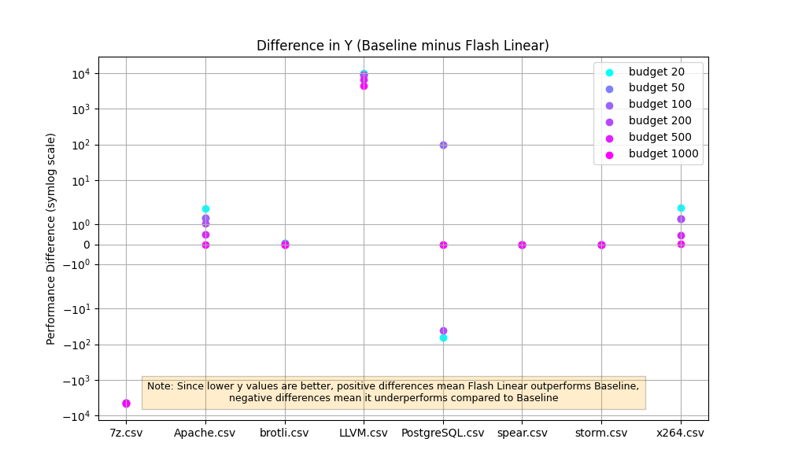

# 要求

问题的出色介绍;现有方法的全面覆盖/比较。该解决方案非常详细，并对基本原理进行了深入解释。所有的实验设置都经过精心设计，细节极佳。定量结果有很好的演示，有深入的讨论，而建议的解决方案至少在一个指标上超过了基线。彻底和建设性的思考和结论。结果是完全可重复和可验证的。

请使用 Time New Roman 或 Arial 字体类型，10pt，单列，单行距来编写报告。预期长度应在 2 到 6 页之间（包括参考文献），A4 大小。更长的报告是可能的，但您需要有充分的理由。

1.3 成果提交要求
最终成果主要为一份系统性的报告，用于记录你的解决方案及其有效性的证明。你不需要提交代码，但应将代码存储在一个公开的代码仓库中，并在报告中附上链接。
报告应至少包含以下几个部分（你可以自由更改标题名称或添加子章节）：
    引言（Introduction）：本节应提供你所解决问题的背景信息，并说明你选择该问题的原因。
    相关工作（Related Work）：本节应讨论已有的解决该问题的方法，并对它们的优缺点进行分析。引用请采用计算机科学领域常见的学术引用格式（如 Chicago 风格），详情可参考：https://pitt.libguides.com/citationhelp/ieee。
    解决方案（Solution）：在这里你可以详细阐述你提出的解决方案。虽然鼓励你提出原创思路，但如果你选择复现已有工作的某个方法，以测试它是否适用于你所选的系统或项目，也完全可以。但你需要用自己的语言详细描述该方法的设计思路，包括背后的设计动机。你也可以设计一个图形用户界面（GUI），但最重要的还是能解决智能软件工程问题的核心算法。
    实验设置（Setup）：本节需要描述你的实验设置和流程，比如所选的系统/项目简介、参数设置、评估指标、对比基线方法，以及使用了哪些统计分析方法等。
    实验结果（Experiments）：你应在这里对你的方案进行定量评估，并理想情况下与基线方法进行对比。需要使用图表来展示结果，并采用课程中介绍的统计检验方法。你还应考虑在多样化场景下进行评估，例如在不同的系统/项目、指标和/或目标下。作为最低要求，你需要涵盖至少一个系统/项目、一个评估指标和一个优化目标（如适用）。结果讨论部分需要描述你从实验观察中得到的发现。
    反思（Reflection）：本节讨论你提出方法的局限性，并思考有哪些改进空间。
    结论（Conclusion）：根据实验结果，总结你的研究结论。
    实验材料链接（Artifact）：在此处提供你代码仓库的链接（如 GitHub 或 Zenodo），其中应包括源码和原始实验数据。
参考文献（References）：任何引用的论文/工作都应在此处按照学术格式正确引用。

# 正文

-----------------------------------------------------------------------------------------------------------------

1.Abstract 

    本文基于ISE lab 3的Configuration Performance Tuning 问题提供的baseline 和数据集设计并部署了6个intelligent turning methods , 并对这些方法进行了测试。最终得到了两个优于baseline 的一个有模型方法（Linear FLASH）和一个无模型方法（Linear BestConfig ），并且提出了一种改进的。本文还探讨了不同前期采样方法的优势和劣势，以及不同模型在一些系统下的理论表现，同时验证了两种假设。

2.Introduction：

    在系统复杂度越来越高的今天，无论是人类还是算法都已经越来越难以理解日益增多的选项对他们的软件所造成的影响，例如其中数据库的设置调优是一个np问题（1），尝试不同的配置的代价也十分高昂。但是，与此同时，软件的设置对于软件的性能有着至关重要的影响。因此我们需要一个能在尽可能少的尝试下尽可能自动算出最优配置的方法，同时在完成lab3时作者基于自身修改软件配置的经验想到了一个可能比随机抽样更好的初始采样。出于智能软件调优是非常重要的领域和作者想验证自己的想法的原因，作者选择了这个主题。

3.Related Work： 

    在配置性能调优领域，调优的方法主要被分为Model free tuning，Model base tuning，以及一些其他的新的调优方法，例如Cross environment tuning，Cost aware tuning，Code sensitive tuning。受限于模拟数据集的限制，我们将不讨论除了有模型调优和无模型调优之外的方法，因为我们的数据集只有一个目标维度，也没有使用来自不同环境的信息，代码等，这导致那些新的调优方法将会失效。下面我将会讨论现有的方法和它们在这项任务中的局限性。

    3.1	Model free tuning

    无模型优化不依赖于预测模型，而是直接评估目标系统或数据集上的每个采样配置。相比于有模型调优这些方法非常准确，因为性能测量是真实的。但是，缺点是评估通常需要大量的计算，导致高昂的计算成本。下面是几种经典的无模型调优

        3.1.1.1Random Search: 它盲目地从整个空间对配置进行采样，尽管结果往往很差，但是只要你够幸运，它就是最快最好的方法。而且这个方法完全不受维度灾难，复杂度指数上升，局部最优，过拟合等问题的影响。本文使用Random Search作为实验的baseline。

        3.1.2BestConfig: 由 Zhu 等人 [2] 提出，通过引入两阶段本地搜索框架（DDS- Divide & Diverge Sampling ，RBS: Recursive Bound & Sea ）进行搜索。DDS 将配置空间划分为子空间以确保覆盖范围和多样性，而 RBS 则根据先前的性能递归地将搜索范围缩小到高潜力区域。在现实生活中BestConfig 往往被用于单目标优化任务。作者认为BestConfig十分适合这个任务，因此尝试了这个模型。

        3.1.3 Meta Multi-Objectivization（MMO）:由Chen 和 Li [3] 提出。MMO 在搜索过程中引入了一个辅助目标，以重塑配置空间，有助于避免较差的局部最优值并鼓励更好的探索。但是作者没有在数据集中找到合适的辅助目标，而且加入太多的先验经验并不是一个好主意，因此本文没有使用MMO。

        3.1.4 NSGA-II : 这个方法被Singh et al [4] 用于 ORM 配置优化。这个方法将配置编码为二进制字符串，并使用遗传算法将它们代代发展。由于其基于遗传算法的性质，它经常收敛缓慢且计算成本高，因此本文没有使用这种方法。

    3.2.	Model base tuning

    基于模型的优化使用预测模型来估计配置性能，从而减少所需的昂贵测量次数。这些方法在测量实际性能和更新学习模型以指导未来采样之间交替。下面是几种经典的有模型调优

        3.2.1 FLASH，FLASH ，由 Nair 等人 [5] 提出，。它由“精确的搜索是不必要的作为“中心指导思想，使用 CART 决策树代替传统的GP作为代理模型（避免了维度更高和假定“smoothness”的问题），同时应用BAZZ（本文的FLASH没有使用BAZZ算法）。作者认为FLASH十分适合这个任务，因此尝试了这个模型。

        3.2.2	BOCA ,由Chen 等人 [6]将贝叶斯优化应用于这个领域，这个模型使用了Random Forest替换了传统的GP，同时具有降低维度的特点，非常适合于二进制的系统设置tuning。不过本文的系统大多都不符合二进制的特点，因此本文没有测试这个方法。

        3.2.3 Bayesian Optimization：这是一种非常经典的方法，用于优化具有未知解析形式的昂贵黑盒函数。在软件配置调优中，BO 维护一个高斯过程 （GP）来近似性能函数。然后，它使用采集功能来平衡采样。这个算法有很多问题，但是作为上面算法的基础，Bayesian Optimization被作者所实现。

在本文中，作者分别进行了两次实验，超越基线（part4）和进一步优化（part5）。在这两个部分中作者设计了一个方法（lab3_forier.py）部署了3个已有的方法（lab3_bayesian.py，lab3_bestconfig.py，lab3_flash.py）改进了两个方法（lab3_bestconfig_linear.py , lab3_flash.py）提出了一种基于选项独立的改进的具有线性复杂度的DDS，验证了两种假设。

4.超越基线

    4.1 超越基线部分的实验方法

    首先就如 part 3 （Related Work）所说，作者评估了6个经典的现有最终决定实现其中的BestConfig 方法，FLASH 方法， 以及 Bayesian 方法和基线进行对比，其中作者把BestConfig 方法，FLASH 方法，是和基线对比的主要模型，Bayesian 方法则作为FLASH 方法的前期工作。在这次实验中------------未完待续

        4.1.1 基线方法，在这次的报告中作者被要求使用随机方法作为基线，

        4.1.2 BestConfig 方法， BestConfig 是一个经典的无模型调优方法，这个方法类似于先广泛的搜索然后在最有可能找到宝藏的区域进行仔细的搜索的策略。本文实现该方法时，严格遵循其两阶段框架：DDS（Divide and Diverge Sampling）+ RBS（Recursive Bound and Search），代码实现详见 lab3_bestconfig.py 文件。
        DDS 阶段：作者首先对每个参数的可能取值按照数量进行划分（默认划分为 k=2 个子区间）。然后对所有参数的子区间组合进行笛卡尔积采样，确保覆盖整个参数空间的代表性子空间。最后作者对每个组合随机选取一个合法配置，组成初始采样集合。
        RBS 阶段：在初始采样中选择性能最优的配置作为当前最优，以这个配置为中心，对每个参数分别限定上下边界，再在缩小的空间中进行递归采样，如果发现新的最优解，则更新边界和当前配置，直至预算耗尽。

        4.1.3 flash方法和Bayesian 方法，为了进一步探索有模型调优方法的效果，本文实现先实现了Bayesian Optimization 方法，然后再Bayesian Optimization的基础上修改代码实现了一种更加适合这种任务的简化的flash方法，代码分别为 lab3_flash.py 和 lab3_bayesian.py。bayesian Optimization（简称 BO）是本实验中实施的第一种基于模型的方法，它使用 skopt 库中的 Optimizer 类实现了典型的高斯过程（Gaussian Process, GP）作为 surrogate model。本文的BO首先将每个参数建模为 Integer 或 Categorical 类型，评估 5 个点，用于训练 GP。然后通过acquisition function（来自skopt的默认的gp_hedge）选择最有前景的点进行评估，并不断更新 GP 模型，同时记录并返回预算内找到的最佳配置直至预算耗尽。
        在实现flash方法时，作者首先简化了原始论文中的多目标采样（BAZZA）部分为简单的贪婪采样（作者曾尝试复现原始论文中的bazza方法，但是基于GP的BAZZA会和Bayesian一样卡死，虽然理论上把gp换成决策树回归器能解决问题。可惜在我的电脑上尝试有模型的方法非常慢，为了后面实验的顺利进行，以及本文处理的是单目标问题，不是非常适合BAZZA，作者并没有继续尝试）然后修改BO方法的GP为CART（Classification and Regression Tree）决策树 ，最终得到了简化的近似的flash模型。

    4.2 超越基线部分的实验结果：

        4.2.1 BestConfig 方法的结果 很差，和基线差不多

        4.2.2 Bayesian 方法的结果 比较好，但是速度非常慢，甚至导致budget为500和1000的实验无法完成

        4.2.3 flash方法的结果 很好，但是速度慢

        4.2.4 模型效果总结
            flash最好，贝叶斯第二， BestConfig最烂

    4.3 目标

        4.3.1 BestConfig 的DDS采样指数增长问题：
        
        bestConfig 的DDS在维度比较大时总是花完预算导致模型无法进入RBS阶段，甚至dds阶段都无法完整完成，完全丧失了dds应有的覆盖范围和多样性。举个例子在大多数系统里（8个设置），预算为100的情况下, it needs to search for k^8 configurations (8 configurations), resulting in insufficient budget.Even if k is set to 2, it still need；s to search for 2^8 configurations (256 configurations), exceeding 100.

        4.3.2 计算开销：

            Bayesian 的计算复杂度问题：GP的训练复杂度为O(n³)，其中n是样本点数量，另外GP的预测复杂度为O(n²)
        

    4.3 超越基线部分的反思

        总体来看，虽然 BestConfig 在理论上具有很强的探索能力，但在现实预算下，BestConfig存在明显限制，本文由此出发，在下一节提出两个基于现实假设的优化方案。

5.进一步优化

    5.1.两种假设：

    假设一：选项对性能的影响是连续的曲线或者直线。在作者玩游戏时，曾经手动对游戏的选项进行调优，发现这些设置对游戏帧数的影响是线性或者指数的，例如分辨率。

    假设二：选项和选项之间大部分彼此独立。这个假设同样出自作者的游戏经验，对于游戏而言每一种不同的选项往往对应这不同的硬件，但是这些选项对于其它硬件的性能影响不大。举个例子在游戏中贴图的分辨率往往和显存的占用强相关，但是在显存没有占用满之前，无论多大的显存占用都不会对其他硬件的占用和游戏帧数有着太高的影响。

    5.2基于假设1提出的模型    ——基于forier变换的曲线回归

        当某些配置选项与性能之间的关系是连续的、可拟合的函数关系（例如线性、指数、周期型等）时，如果我们能够对这些参数做函数拟合，并利用数学变换对其建模，则有可能在非常少的采样预算下，快速估计性能最优点的位置。为了验证这一假设，本文设计并实现了一种基于傅里叶变换（Fourier Transform）的回归方法。
        
        其主要思路为：首先使用 DDS 或随机采样获取少量配置与其对应的性能值，将每一个参数视为一维信号，性能值作为目标函数，对每个维度的参数分别进行傅里叶级数拟合，试图通过频谱分析逆推出可能的最优组合，在估计出最优组合后，进行采样。
        
        当配置影响具有一定周期性或可预测性时，Fourier 分解可快速逼近真实函数形式，并跳过大量冗余搜索。但是假设选项本质上为离散或跳跃型（如布尔值、类别型设置），则拟合效果将非常差。这将验证曲线拟合对数据集的有效性和数据集的离散程度。

        在具体实验中，本文将该方法实现为 lab3_forier.py。

    5.3基于假设2提出的优化方向  ——线性采样DDS

        在 4.3.1 中我们已经指出，原始 BestConfig 方法中的 DDS（Divide and Diverge Sampling）阶段存在指数级别的复杂度瓶颈，导致预算快速的被消耗殆尽。
        
        这种复杂度的快速提升是因为传统的DDS考虑了选项之间的相互影响，但是假如选项和选项之间大多数彼此独立，我们则不需要遵循这个规律，只对某一个选项采样k次（而不是kd次）。基于这个假设作者提出了一种具有线性时间复杂度的采样策略，称为线性采样DDS（Linear DDS），它是对原始 DDS 策略的一种改进，在不显著降低采样覆盖性的前提下，将复杂度从 O(k^d) 降低为 O(k * d)。但是如果选项之间彼此相关，这种优化后的dds应该不会比随机采样的结果好太多，因此这种这种线性采样DDS不但能作为一个优化方向，还能从侧面印证选项之间的相关性——也就是我们的猜想2.
        
        线性采样DDS有下面2个特点：
            线性复杂度：仅对每个参数采样 k 次，总采样数为 k * d，相比原始 k^d 大幅降低。
            覆盖性：每个参数的每个区间至少采样一次，保留了基本的探索多样性。

        下面是伪代码
        
        Input: 
            - data: 配置数据集（含多个配置参数和性能列）
            - k: 每个参数划分的区间数（如 k = 2）
            - budget: 最大采样预算（如 100）

        Output: 
            - initial_samples: 线性采样得到的初始配置列表

        Step 1: 初始化参数区间划分
            for each configuration parameter col in data:
                unique_vals ← sorted(unique values of col)
                intervals[col] ← divide unique_vals into k equal chunks

        Step 2: 初始化初始样本集合
            initial_samples ← empty list

        Step 3: 执行线性 DDS 采样（O(k * d)）
            for each configuration parameter col_index, col:
                col_intervals ← intervals[col]
                for each subrange_index, subrange in col_intervals:
                    val ← randomly sample one value from subrange
                    sample ← default configuration（所有参数设置为该列众数，这里替换为众数是因为如果这个数随机的，采样往往搜索不到结果。但是这与真实情况不符，因为在现实世界的调优问题中我们总是能得到性能值。现实世界的调优需要把这个改成一个随机值）
                    sample[col_index] ← val  # 替换当前参数为采样值
                    Add sample to initial_samples
        Return initial_samples

    5.4实验设计------------------------同4.1

    5.5实验结果

        5.5.1 对比原来的模型的实验结果

*FLASH线性变体与原始FLASH对比（结果差不多） 图二来自4.2.1 *

*BestConfig快速变体与原始BestConfig对比（fast明显优于普通版）图二来自4.2.3*

        5.5.2假设1，不成立  ---基于forier变换的曲线回归结果全面不如基线

            Fourier 变换假设的是全局平稳性和周期性，但是对于性能来说，现实中许多系统设置的高低是非线性的。

            我的评价是，这是第一个打不过基线的

        5.5.3假设2，大部分情况下成立  —— 线性采样DDS对bestconfig非常有效但是仍然有几个大幅度落后基线的系统，另外对于flash来说线性采样DDS和随机采样表现差不多

            # 见表5.5.1 

        5.5.4 横向对比

            我还根据之前的数据得到了在相同的预算下不同的模型产生最好的结果的性能。

            results_in_budget_xx.png

    5.6进一步验证

        comparison_random_search_vs_bestconfig_fast_search_xxx_b100.png

6.反思

7.结论

8.最终的解决方案

9.引用

实验材料链接（Artifact）： 
参考文献（References）：任何引用的论文/工作都应在此处按照学术格式正确引用。
[1]： SULLIVAN D G, SELTZER M I, PFEFFER A. Using probabilistic reasoning to automate software
tuning[C]//Proceedings of the joint international conference on Measurement and modeling of
computer systems. ACM, 2004: 404-
[2]
[3]

